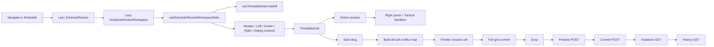

# ATLAS Timetabling Performance Audit

**Audit date:** 2026-07-13  
**Surface:** Scheduler `/timetable` route  
**Scope:** Navigation, first visit, grid interaction, session selection, drag-and-drop, live conflict feedback, preview/commit, and the existing performance test harness  
**Status:** **FUNCTIONAL RECOVERY GO / PERFORMANCE CLOSURE NO-GO** — Tailnet became reachable on 2026-07-13 and the shell crash, blank stale-latest workspace, automatic Tactical Sandbox mount, and redundant same-cell drag-over updates were repaired live. Core-grid readiness, latest-run resolution, route payload, frame/commit budgets, fresh-run truth, and older-user evidence remain open. See `docs/verification/timetable-performance-live-closure-2026-07-13.md`.

## Executive assessment

The page's performance problem is not one slow component. It is a chain reaction:

1. The first visit waits through a mostly sequential data-loading path and loads a broad workspace chunk.
2. Selecting one session updates root-owned state, rebuilds all workspace contexts, expands inspector surfaces, and automatically starts expensive Tactical Sandbox calculations.
3. Starting a drag synchronously builds conflict details for every timetable cell.
4. Crossing grid cells updates grid state at pointer frequency and rerenders the full timetable, including per-cell droppable hooks and draggable sessions.
5. Dropping a session enters a serial preview, commit, violations refresh, and history refresh path.

This architecture makes otherwise useful features compete for the same main-thread frame. The live conflict inspector is the most visible symptom, but optimizing its algorithm alone will not remove the lag unless render boundaries and selection behavior are also corrected.

## Evidence status

| Evidence | Result | Interpretation |
|---|---|---|
| Tailnet `https://njgrm.buru-degree.ts.net` | HTTP 502 | Live navigation and interaction measurements are blocked. |
| Local API health | HTTP 200 when the normal dev stack was available | Local runtime is usable as supporting evidence. |
| Existing Playwright timetable smoke | Timed out at 60 seconds on a `Class Program Matrix` locator after the page rendered `Network Error` | The current smoke test cannot distinguish runtime availability from UI performance and is not a performance gate. |
| Existing timetable workspace asset | `ScheduleReviewWorkspace-BZS-sI2Q.js` is 374,205 bytes uncompressed in the current tracked build output | The route chunk is broad before secondary feature chunks and transfer compression are considered. |
| Performance instrumentation | No navigation, long-task, React commit, selection latency, drag-frame, or conflict-calculation measurements exist | Prompt 0 is mandatory before implementation. |
| Playwright tracing | `trace: on-first-retry` with `retries: 0` | The current configuration never retains a trace. |
| Test authentication fixture | Timetable smoke defaults to an invalid password | Missing environment configuration can add a slow external fallback and contaminate measurements. |
| Playwright output lifecycle | A diagnostic run cleaned/replaced files in the shared tracked report/results directories | Performance runs need an isolated or timestamped output directory so baseline evidence is not destroyed. |

## Page and hot-path map

## Findings by journey

### 1. Navigation and first visit — High

`loadAll` waits for school year, then runs, then reference data, then run data. Secondary draft-board and room-request calls are deferred, but the core path is still a waterfall. Request filter state is also included in the `loadAll` callback dependencies, so changing request filters can recreate the loader and rerun the core timetable effect while a separate effect fetches the filtered request summary.

**Evidence**

- `atlas-client/src/hooks/useTimetableData.ts:1082-1114`
- `atlas-client/src/hooks/useTimetableData.ts:1129-1153`
- `atlas-client/src/hooks/useTimetableData.ts:838-902`
- `atlas-client/src/hooks/useTimetableData.ts:998-1051`

**Impact**

- Slow time to usable grid on a cold visit.
- Unrelated room-request filter changes can repeat core work.
- A failure in a required source currently collapses the whole workspace to a generic network error, preventing meaningful feature-level diagnostics.

**Required direction**

- Establish request and render timing first.
- Parallelize independent reads after the active school year is known, or introduce a bounded bootstrap contract.
- Render the grid when its minimum viable data is ready.
- Lazy-load rail diagnostics, policy, room requests, edit history, and other secondary data at feature intent.
- Remove request filters from the core timetable loader and deduplicate/cancel repeated reads.

### 2. Route and first-use JavaScript — High

The route uses nested lazy loading, but `CenterWorkspace` eagerly imports several mutually exclusive views and a large Tactical Sandbox feature. The current built workspace asset is 374,205 bytes uncompressed.

**Evidence**

- `atlas-client/src/pages/ScheduleReview.tsx:5-10`
- `atlas-client/src/components/timetable/CenterWorkspace.tsx:2-11`
- `atlas-client/src/components/timetable/CenterWorkspace.tsx:324-645`
- `atlas-client/dist/assets/ScheduleReviewWorkspace-BZS-sI2Q.js`

**Impact**

- The initial schedule view pays parse/evaluation cost for policy, map, building, manual-edit, matrix, and sandbox features that may not be used.
- Nested chunk discovery adds another dependent request on a cold route visit.

**Required direction**

- Lazy-load mutually exclusive center views and heavy dialogs/docks.
- Prefetch secondary features only after the core grid is interactive or on explicit navigation intent.
- Set a route-JavaScript budget using measured compressed transfer and parse/evaluation time, not raw size alone.

### 3. Session selection — Critical

Selecting an entry updates root-owned selection state, expands the right panel, and `CenterWorkspace` automatically opens the Tactical Sandbox. The sandbox evaluates eligible faculty by mapping the complete draft separately for each candidate and then calculates teaching hours over that projected array. It subsequently renders the entire filtered candidate list without virtualization.

**Evidence**

- `atlas-client/src/hooks/useTimetableMutations.ts:571-580`
- `atlas-client/src/components/timetable/CenterWorkspace.tsx:212-235`
- `atlas-client/src/components/timetable/CenterWorkspace.tsx:626-650`
- `atlas-client/src/components/timetable/TacticalSandboxDock.tsx:283-317`
- `atlas-client/src/components/timetable/TacticalSandboxDock.tsx:646-690`

**Complexity**

- Candidate preparation is approximately `O(eligible faculty × schedule entries)` and allocates a projected schedule array per candidate.
- Selection also triggers broad workspace commits because the root reconstructs large context objects.

**Impact**

- Simple selection feels like a heavy edit command.
- Older or low-end devices pay CPU, allocation, layout, and animation cost at the same moment.

**Required direction**

- Do not auto-run or auto-open the heavy sandbox for simple selection.
- Pre-index faculty workload once in `O(entries)` and apply a selected-entry delta per candidate.
- Cache eligibility by subject/term where the source data is unchanged.
- Virtualize or incrementally reveal candidate cards.
- Use one clear inspector expansion behavior rather than simultaneously expanding multiple surfaces.

### 4. Drag start and live conflict activation — Critical

When a drag or keyboard placement source becomes active, `cellConflictMap` rebuilds slot and daily-workload indexes from all active entries, loops over every day and time slot, evaluates section/room/faculty/load conflicts, and constructs human-readable reasons and displaced-session records for every cell.

**Evidence**

- `atlas-client/src/hooks/useTimetableData.ts:491-544`
- `atlas-client/src/hooks/useTimetableData.ts:546-697`

**Impact**

- The expensive calculation shares the same render that should paint the drag overlay.
- Most allocated detail is never read because the user hovers only one destination at a time.
- Exact `day-start-end` keys do not detect all partial interval overlaps; a later correctness fix could make the path even slower if implemented with nested scans.

**Required direction**

- Maintain reusable per-day section, room, and faculty interval indexes when entries change.
- Produce compact conflict severity/identity results for visible candidate cells.
- Hydrate human-readable reasons and displaced details only for the hovered or keyboard-focused cell.
- Add interval-overlap correctness tests before changing the algorithm.
- Move optional whole-grid coloring to a transition or worker only if profiling proves it is still necessary.

### 5. Drag-over rendering — Critical

`TimetableGrid` stores the active drop target locally and updates it in `useDndMonitor.onDragOver`. Each crossed cell rerenders the full table, including every droppable cell and draggable session. The root drag-over handler also invokes rail drop-zone setters on every event; primitive equality may prevent some commits, but the state work remains in the pointer loop.

**Evidence**

- `atlas-client/src/components/timetable/TimetableGrid.tsx:140-146`
- `atlas-client/src/components/timetable/TimetableGrid.tsx:213-225`
- `atlas-client/src/components/timetable/TimetableGrid.tsx:261-555`
- `atlas-client/src/hooks/useTimetableDragDrop.ts:90-102`
- `atlas-client/src/components/timetable/ScheduleReviewWorkspace.tsx:61-77`

**Impact**

- Pointer movement and React reconciliation compete inside a 16.7 ms frame budget.
- The number of registered droppables increases collision-detection work.
- Inline cell/session objects and handlers make memoization ineffective.

**Required direction**

- Isolate the active cell so only the previous and current target cells update.
- Stabilize cell/session props and handlers.
- Profile a grid-specific collision strategy rather than relying on a large generic droppable registry.
- Localize ephemeral drag state away from the page root and side panels.

### 6. Tooltip and conflict-inspector DOM churn — High

At drag start, `showHeavyTooltips` changes and every conflicting cell swaps between a tooltip subtree and lighter markup. Drag end reverses the operation.

**Evidence**

- `atlas-client/src/components/timetable/TimetableGrid.tsx:237-239`
- `atlas-client/src/components/timetable/TimetableGrid.tsx:357-427`

**Impact**

- Large mount/unmount bursts happen at gesture boundaries.
- Conflict-detail DOM scales with the number of cells rather than the single active target.

**Required direction**

- Keep cell DOM stable across drag states.
- Mount at most one shared conflict inspector/tooltip for the active cell.
- Disable hover behavior with state/CSS without replacing the complete subtree.

### 7. Root state and context fan-out — High

The main state hook creates five very large context objects in an un-memoized IIFE on every render. The workspace then creates another inline body context. Selection, drag, preview, loading, presence, and remote-selection changes therefore invalidate broad component subtrees.

**Evidence**

- `atlas-client/src/hooks/useScheduleReviewWorkspaceState.ts:903-920`
- `atlas-client/src/components/timetable/ScheduleReviewWorkspace.tsx:63-77`
- `atlas-client/src/hooks/useTimetableCollaboration.ts:104-113`

**Impact**

- Memoized consumers cannot reliably bail out.
- Header, left rail, right panel, and center can commit for grid-only interaction state.

**Required direction**

- Split state and contexts by surface and update frequency.
- Memoize stable slices and pass primitives/stable callbacks.
- Keep drag/hover state next to the grid.
- Coalesce outbound collaborative selections and isolate remote presence from grid props.

### 8. Drop preview and commit — High

A normal move performs a preview request, then commit, then violations refresh, then edit-history refresh. Novel targets do not benefit from the preview cache, and pre-generation auto-preview does not have a clearly proven abort/stale-response guard.

**Evidence**

- `atlas-client/src/hooks/useTimetableMutations.ts:795-849`
- `atlas-client/src/hooks/useTimetableMutations.ts:1270-1317`
- `atlas-client/src/hooks/useScheduleReviewWorkspaceState.ts:668-692`

**Impact**

- Pointer-up acknowledgement and final settled state are delayed by serial network work.
- Rapid preview changes can waste server/client work or risk stale presentation.

**Required direction**

- Give immediate optimistic visual acknowledgement with rollback.
- Abort or supersede stale preview requests.
- Bound and version-scope preview caching.
- Return updated violation/history metadata from commit, or revalidate independent reads concurrently.

### 9. Artificial transition lag — Medium

A fixed 180 ms pivot transition loading state is activated by local filter/view changes and feeds the global top loading strip.

**Evidence**

- `atlas-client/src/hooks/useScheduleReviewWorkspaceState.ts:266-274`
- `atlas-client/src/hooks/useScheduleReviewWorkspaceState.ts:922-940`

**Impact**

- Synchronous local interactions intentionally look slower.
- A global loading indicator obscures which feature is actually busy.

**Required direction**

- Remove the timer-based loading state.
- Use measured transition pending state only when work crosses a perceptible threshold.
- Keep loading feedback local to the feature performing asynchronous work.

## Performance budgets for remediation

These are engineering gates for the sequential prompts. Prompt 0 must capture the actual baseline and document the target device/network profile.

| Journey | Target gate |
|---|---|
| Cold authenticated `/timetable` visit | Core grid interactive at p75 ≤ 1.5 s on the agreed school device/network profile. |
| Warm in-app navigation | Core grid interactive at p75 ≤ 500 ms. |
| Session selection | Selection feedback ≤ 100 ms; intended inspector visible p95 ≤ 150 ms; no automatic heavy candidate calculation. |
| Drag start | Overlay and active styling p95 ≤ 100 ms; conflict activation p95 ≤ 16 ms at the agreed scale. |
| Drag frame | Pointer-move scripting + rendering p95 < 8 ms; ≥55 FPS; no long task >50 ms during a 10-second drag. |
| Drag commits | Only old/new target cells commit; Header/Left/Right do not commit for ordinary cell crossing. |
| Conflict detail | Hover/focus detail calculation p95 < 4 ms; no whole-index rebuild while pointer moves. |
| Tactical candidate calculation | <10 ms at 1,000 entries and 250 faculty; initial candidate DOM ≤30 cards. |
| Drop acknowledgement | Visual acknowledgement <100 ms; preview p95 <300 ms; settled successful move <800 ms on LAN. |
| Preview concurrency | At most one relevant in-flight preview per active source/target; stale responses never win. |
| Network duplication | A room-request filter change performs zero core timetable reloads. |
| Route JavaScript | Reduce measured initial timetable-route JavaScript transfer by at least 30% from Prompt 0 baseline and enforce a regression budget. |

## Prioritized remediation sequence

| Prompt | Phase | Why it is ordered here |
|---|---|---|
| 0 | Measurement and reproducible baseline | Prevents speculative optimization and creates before/after proof. |
| 1 | Pointer-frequency render containment | Removes the most direct source of visible drag lag. |
| 2 | Indexed, lazy live conflict engine | Removes eager whole-grid conflict work after render boundaries are measurable. |
| 3 | Selection and Tactical Sandbox optimization | Separates inspection from heavy editing and eliminates `O(F×E)` allocation. |
| 4 | Workspace state/context isolation | Stops selection, presence, preview, and drag state from invalidating unrelated surfaces. |
| 5 | Navigation/data-load flattening and mutation latency | Improves first visit and pointer-up-to-settled time without mixing it into render refactors. |
| 6 | Code splitting, regression budgets, and live closure | Reduces first-use cost and proves the complete roadmap on Tailnet and target hardware. |

## KISS and older-user guardrails

Performance work must preserve a foolproof interaction model:

- Clicking a session selects it immediately and shows concise details; it must not unexpectedly open an advanced editing tool.
- Dragging must show one clear destination state: available, warning, or blocked.
- Conflict language must remain human-readable and explain what the user can do next.
- Keyboard/tap placement must remain equivalent to pointer drag behavior.
- Reduced-motion users must receive immediate state changes without essential information being animation-dependent.
- Optimistic movement must never imply a save succeeded before server confirmation; use a plain pending state and safe rollback.
- No optimization may weaken hard-conflict, publish, permission, source-of-truth, or collaboration correctness.

## Audit verdict

The timetable is feature-rich but its interaction architecture is not yet performance-safe for older, non-technical users on lower-end school hardware. The highest-value work is to make selection cheap, constrain drag updates to the two affected cells, and compute detailed conflict information only for the active target. Live closure remains blocked until the Tailnet route is healthy and Prompt 0 captures a reproducible baseline.
